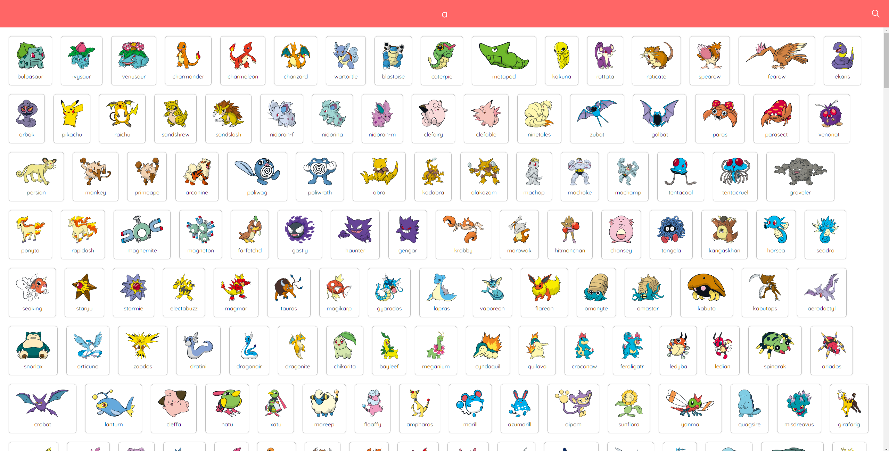
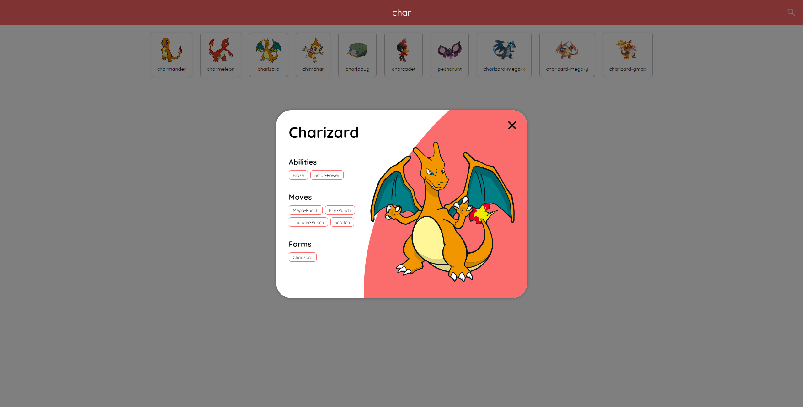

# Pokihunter

Pokihunter is a modern Pokémon search application built using React.js and Node.js. It provides users with an intuitive interface to explore detailed information about Pokémon sourced from the PokeAPI.

## Features

- **Search Functionality:** Easily search for Pokémon by name.
- **Comprehensive Details:** Access detailed attributes and information about each Pokémon.
- **Caching Mechanism:** Optimized performance with a caching mechanism for faster results on repeated queries.

## Components

### 1. Web Service API

- **Description:** Backend component developed with Node.js.
- **Functionality:** Serves RESTful APIs fetching Pokémon details from the PokeAPI.
- **Caching:** Implements caching to store vendor responses for improved performance.
- **Cache Handling:** Manages cache expiry and maximum cache entries.

### 2. Frontend Layer

- **Description:** Built using React.js, providing an intuitive user interface.
- **Design:** Creatively designed UI for engaging user experience.
- **Rich Information Display:** Showcases comprehensive Pokémon attributes sourced from the API.

## Screenshots

#### Search:

#### List:

#### Detail:
